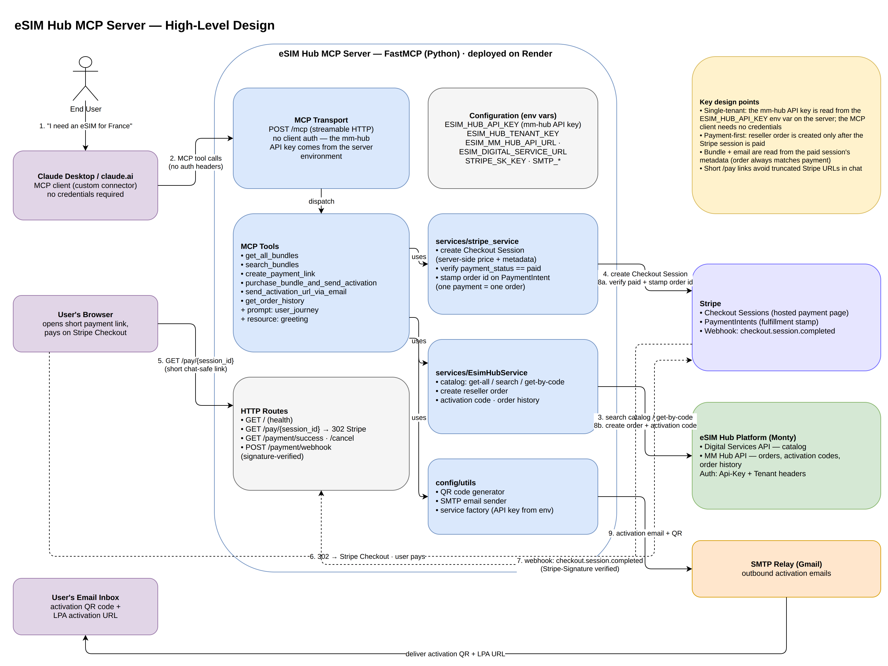
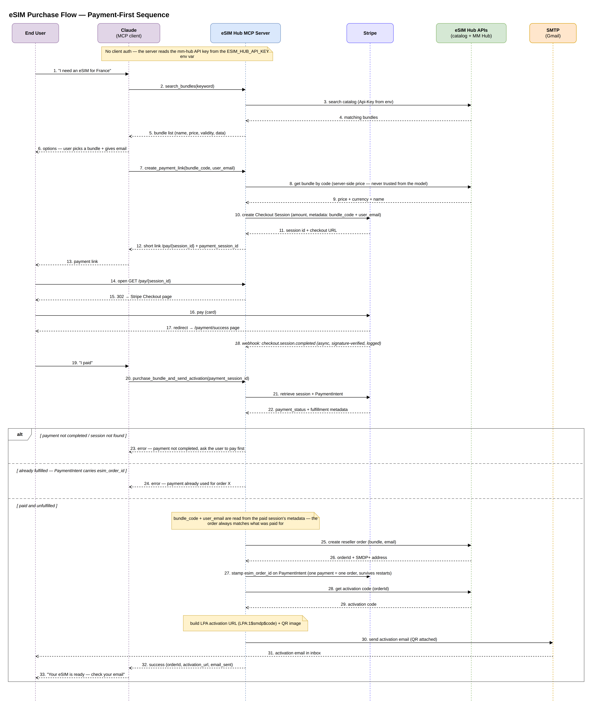

# eSIM Hub MCP API

A FastAPI-based Model Context Protocol (MCP) server that provides tools for managing eSIM bundles through the eSIM Hub service.

## Overview

This project implements an MCP server that exposes eSIM Hub functionality as tools that can be used by AI assistants and other MCP clients. It provides a REST API interface and MCP tools for fetching and purchasing eSIM bundles.

## Architecture

### High-Level Design

All components and how they connect — the Claude MCP client, the FastMCP server internals
(tools, HTTP routes, services), and the external systems (Stripe, eSIM Hub platform, SMTP):



### Purchase Flow (sequence)

The payment-first purchase end to end: discovery → payment link → Stripe Checkout → verified
fulfillment, including the unpaid / already-fulfilled rejection branches:



Editable sources: [`docs/esim-hub-mcp-hld.drawio`](docs/esim-hub-mcp-hld.drawio) and
[`docs/purchase-flow-sequence.drawio`](docs/purchase-flow-sequence.drawio) (open in
[draw.io](https://app.diagrams.net)). A Mermaid version of the sequence diagram is also available
at [`docs/purchase-flow-sequence.mmd`](docs/purchase-flow-sequence.mmd).

To re-export the PNGs after editing:

```bash
drawio -x -f png -s 2 --border 20 -o docs/<name>.png docs/<name>.drawio
```

## Features

- **MCP Tools Integration**: Exposes eSIM Hub operations as MCP tools
- **REST API**: FastAPI-based HTTP endpoints
- **Bundle Management**: Fetch all available eSIM bundles
- **Purchase Operations**: Purchase eSIM bundles by bundle code
- **Health Monitoring**: Health check endpoints

## Project Structure

```
esim-hub-mcp/
├── main.py                     # FastAPI app with MCP integration
├── requirements.txt            # Python dependencies
├── .env                       # Environment configuration
├── .gitignore                 # Git ignore rules
├── config/
│   └── utils.py               # Configuration utilities
├── dto/
│   ├── __init__.py
│   ├── bundle.py              # Bundle data models
│   └── mapper.py              # Data mapping utilities
└── services/
    ├── __init__.py
    └── esim_hub_service.py    # eSIM Hub API client
```

## Installation

1. **Clone the repository**:
   ```bash
   git clone <repository-url>
   cd esim-hub-mcp
   ```

2. **Create a virtual environment**:
   ```bash
   python -m venv venv
   source venv/bin/activate  # On Windows: venv\Scripts\activate
   ```

3. **Install dependencies**:
   ```bash
   pip install -r requirements.txt
   ```

4. **Configure environment variables**:
   Create a `.env` file in the project root with the following variables:
   ```env
   ESIM_HUB_API_KEY=your_api_key_here
   ESIM_MM_HUB_API_URL=https://mm-hub-api-software-qa.montylocal.net
   ESIM_DIGITAL_SERVICE_URL=https://digital-services-api-software-qa.montylocal.net
   ESIM_HUB_TENANT_KEY=your_tenant_key_here
   SMTP_SERVER=smtp.gmail.com
   SMTP_PORT=587
   SMTP_USE_TLS=true
   SMTP_USERNAME=your_username
   SMTP_PASSWORD=your_password
   SMTP_SENDER=noreply@yourdomain.com
   SMTP_SENDER_NAME=Esim Support
   ```

## Environment Variables

| Variable | Description | Required |
|----------|-------------|----------|
| `ESIM_HUB_API_KEY` | API key for eSIM Hub authentication | Yes |
| `ESIM_MM_HUB_API_URL` | Base URL for MM Hub API | Yes |
| `ESIM_DIGITAL_SERVICE_URL` | Base URL for Digital Services API | Yes |
| `ESIM_HUB_TENANT_KEY` | Tenant key for multi-tenant access | Yes |
| `SMTP_SERVER` | SMTP server hostname | Yes (for email) |
| `SMTP_PORT` | SMTP port (587 or 465) | Yes (for email) |
| `SMTP_USE_TLS` | Use SSL/TLS (true/false) | Yes (for email) |
| `SMTP_USERNAME` | SMTP username | Yes (for email) |
| `SMTP_PASSWORD` | SMTP password | Yes (for email) |
| `SMTP_SENDER` | Sender email address | Recommended |
| `SMTP_SENDER_NAME` | Sender display name | Recommended |
| `MCP_BASE_URL` | Public URL of this server, used in Stripe payment redirect links (defaults to the Render URL) | Recommended |
| `STRIPE_SK_KEY` | Stripe secret key used to create and verify Checkout payments | Yes |
| `STRIPE_WEBHOOK_KEY` | Stripe webhook signing secret (`whsec_...`) for `POST /payment/webhook` | Yes (for webhooks) |

## Usage

### Running the Server Locally

Start the MCP server via the included runner (binds to 0.0.0.0 and respects PORT env var):

```bash
python main.py --server_type=http --port 8000
```

### Connecting Claude Desktop / claude.ai (Custom Connector)

The server does not require any authentication from the MCP client: the mm-hub API key is
read from the `ESIM_HUB_API_KEY` environment variable on the server and used for all calls
to the eSIM Hub.

1. In Claude Desktop (or claude.ai): **Settings → Connectors → Add custom connector**
2. URL: `https://esim-hub-mcp.onrender.com/mcp`
3. Click **Connect** — no OAuth or credentials are needed.

The server will be available at:
- **REST API**: http://localhost:8000
- **MCP Server**: http://localhost:8000/mcp
- **API Documentation**: http://localhost:8000/docs

### Available Endpoints

#### REST API
- `GET /` - Health check endpoint

#### MCP Tools
The following tools are available through the MCP interface:

1. **get_all_bundles()**: Fetch all available eSIM bundles
   - Returns: List of bundle objects with details like name, price, data allowance, etc.

2. **search_bundles(keyword: str)**: Search bundles by keyword

3. **create_payment_link(bundle_code: str, user_email: str)**: Create a Stripe Checkout payment
   link for a bundle, priced server-side from the eSIM Hub. Returns `payment_url` (for the user
   to pay) and `payment_session_id` (for the purchase step).

4. **purchase_bundle_and_send_activation(payment_session_id: str)**: Verifies the Stripe payment
   is completed, then creates the reseller order, fetches the activation code, and emails the
   activation QR to the user. The bundle and email are taken from the paid session's metadata,
   and each payment can fund only one order.

5. **send_activation_url_via_email(user_email: str, activation_url: str)**: Email the activation URL to the user

6. **get_order_history(user_email: str)**: Get order history for a user

#### Purchase Flow (payment-first)
1. User picks a bundle → `create_payment_link` returns a Stripe URL
2. User pays through the link (Stripe Checkout)
3. User confirms → `purchase_bundle_and_send_activation(payment_session_id)` verifies
   `payment_status == "paid"`, creates the order, and emails the activation details

### Example Usage

#### Using REST API
```bash
# Health check
curl http://localhost:8000/

# Access MCP interface
curl http://localhost:8000/mcp
```

## Deploying to Render

You may deploy using either the Render dashboard (manual) or the provided Blueprint file.

### Option A: Render Dashboard (Manual)
- Build Command:
  ```bash
  pip install -r requirements.txt
  ```
- Start Command:
  ```bash
  python main.py --server_type=sse --port $PORT
  ```
- Health Check Path: `/`
- Environment: Set all variables listed in the Environment Variables section.

This replaces any `uv run ...` usage (Render images don’t include `uv`).

### Option B: Render Blueprint (render.yaml)
A `render.yaml` is included at the repo root. It defines a Web Service with the proper build and start commands and a health check. To use it:
1. Push this repository to GitHub/GitLab.
2. In Render, create a new Blueprint and point it to the repo.
3. Set the environment variables in the Render dashboard.

The service will bind to `0.0.0.0` and read the port from `$PORT` automatically.

## Dependencies

Key dependencies include:
- **FastAPI**: Web framework for the REST API
- **FastMCP**: MCP server implementation
- **httpx**: Async HTTP client for eSIM Hub API calls
- **pydantic**: Data validation and settings management
- **python-dotenv**: Environment variable management
- **loguru**: Enhanced logging

See `requirements.txt` for the complete list of dependencies.

## Development

### Project Architecture

The project follows a clean architecture pattern:

- **`main.py`**: Entry point with FastAPI app and MCP tool definitions
- **`services/`**: Business logic and external API integrations
- **`dto/`**: Data Transfer Objects and mapping utilities
- **`config/`**: Configuration management and service instantiation

### Adding New Tools

To add new MCP tools:

1. Define the tool function in `main.py`:
   ```python
   @mcp.tool
   async def new_tool(param: str) -> dict:
       """Description of the new tool."""
       # Implementation here
       return {"result": "success"}
   ```

2. Implement business logic in the appropriate service
3. Update documentation

### Testing

Run tests with:
```bash
python -m pytest test.py
```

## Security Notes

- Keep your `.env` file secure and never commit it to version control
- The API key and tenant key provide access to eSIM Hub services
- Use HTTPS in production environments
- Ensure your SMTP provider allows connections from Render and chosen port (587/465)
- Consider implementing rate limiting for production deployments

## License

[Add your license information here]

## Contributing

[Add contribution guidelines here]

## Support

For issues and questions:
- Create an issue in the repository
- Check the API documentation at `/docs` when the server is running
- Review the logs for debugging information
